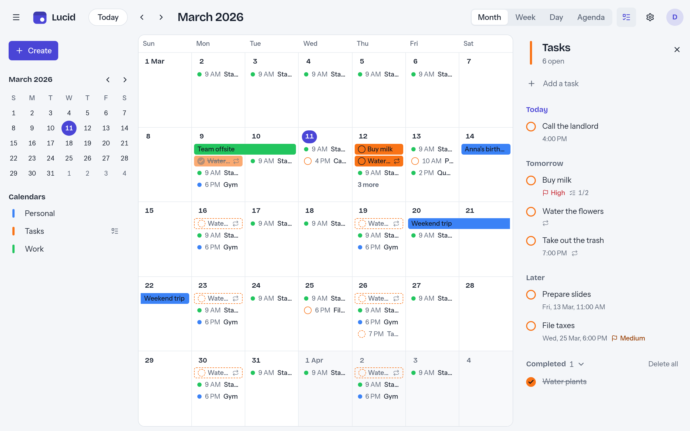
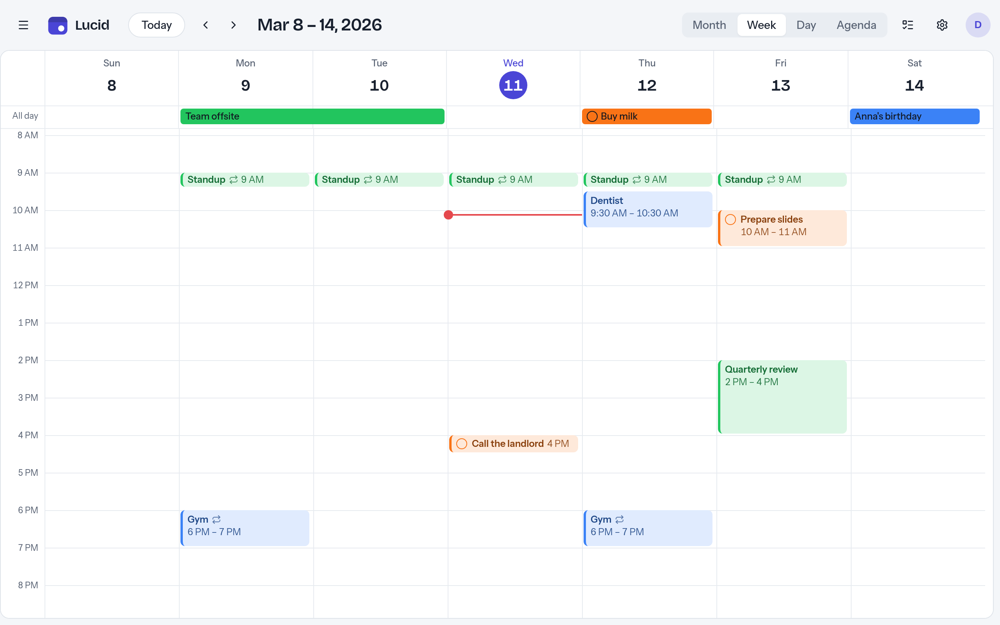
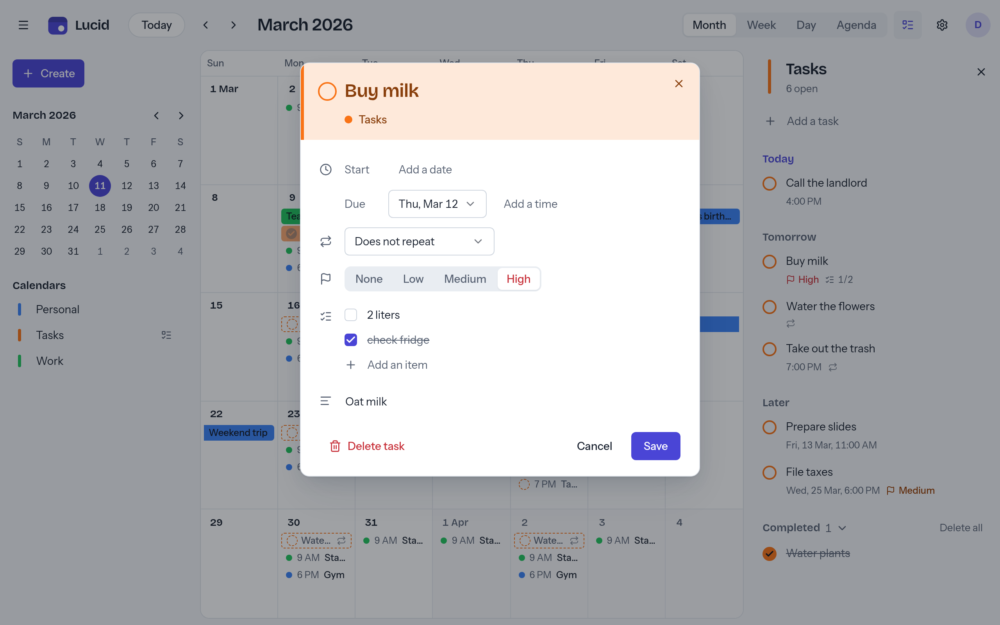
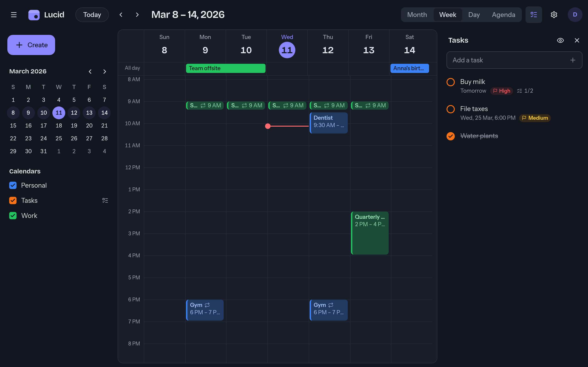
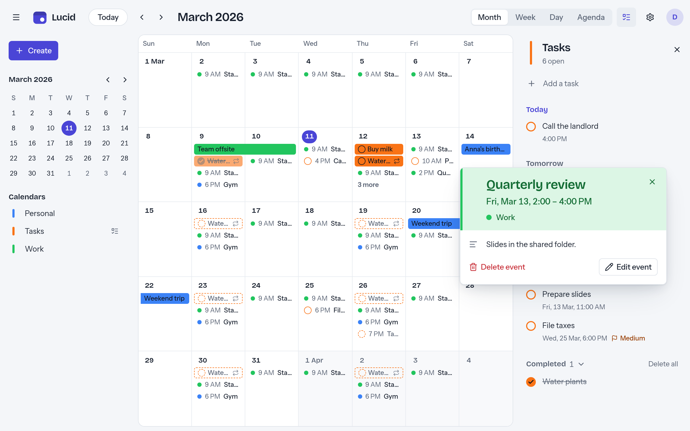
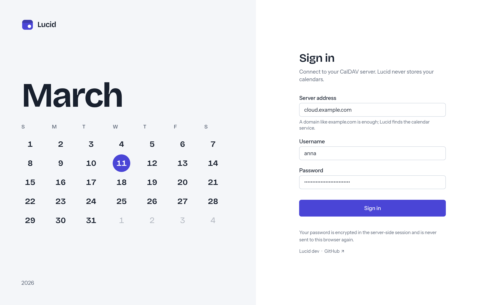
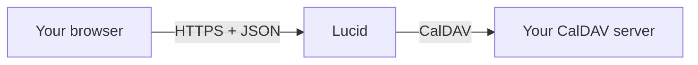

<p align="center">
  
</p>

<h1 align="center">Lucid</h1>

<p align="center">
  <strong>Self-hostable web client for your CalDAV calendars and tasks that actually looks good.</strong><br>
  Works with Nextcloud, Synology, Radicale, Baïkal, iCloud and more.
</p>

<p align="center">
  <a href="https://github.com/tbckr/lucid/actions/workflows/ci.yml"></a>
  <a href="https://github.com/tbckr/lucid/actions/workflows/codeql.yml"></a>
  <a href="LICENSE"></a>
</p>

<p align="center">
  <a href="#features">Features</a> ·
  <a href="#quick-start">Quick start</a> ·
  <a href="#configuration">Configuration</a> ·
  <a href="#security">Security</a> ·
  <a href="#contributing">Contributing</a>
</p>

Lucid gives the CalDAV server you already have a calendar you enjoy opening:
the views and drag & drop you know from Google Calendar, tasks with
checklists, light and dark mode. Your data stays where it is. There is nothing
to migrate and no database to run, just a single binary or container in front
of your server.

<p align="center">
  
</p>

## Features

- **Calendar views:** month, week, day and agenda, with a color and a
  show/hide toggle for every calendar.
- **Drag & drop:** move and resize events right in the calendar; changes show
  up instantly.
- **Tasks:** a task sidebar with checklists, start and due dates, priorities
  and completion. Tasks with a date also appear in the calendar views, where
  you can check them off or hide them once they're done. Checklists are saved
  as plain Markdown task lines, so your other apps can still read them.
- **Recurring events and time zones:** recurring series, all-day and timed
  events, always shown in your local time zone.
- **Easy login:** enter just your domain; Lucid finds the CalDAV endpoint via
  `/.well-known/caldav` and DNS SRV records.
- **Fast:** repeated requests are answered from a short-lived cache that
  checks your server for changes.
- **Yours to adjust:** light and dark mode, English and German, date and time
  formats that follow your locale or your own choice in the settings.
- **Keyboard friendly:** shortcuts and full keyboard navigation (WCAG 2.1 AA
  target).
- **Easy to run:** a single static binary or distroless container, a NixOS
  module, JSON logs, Prometheus metrics and health endpoints.

## Screenshots

<table>
  <tr>
    <td></td>
    <td></td>
  </tr>
  <tr>
    <td align="center">Tasks right in the calendar</td>
    <td align="center">Tasks with checklists</td>
  </tr>
  <tr>
    <td></td>
    <td></td>
  </tr>
  <tr>
    <td align="center">Week view in dark mode</td>
    <td align="center">Event details</td>
  </tr>
  <tr>
    <td colspan="2" align="center"></td>
  </tr>
  <tr>
    <td colspan="2" align="center">Sign in with just your domain</td>
  </tr>
</table>

## How it works



Lucid is a *smart proxy*: a single Go binary with the web app embedded. It
talks JSON to your browser and CalDAV to your server. Your CalDAV server stays
the single source of truth; Lucid only keeps sessions and a short-lived cache
in memory. After login, your browser holds nothing but a session cookie, never
your CalDAV credentials.

## Quick start

> [!IMPORTANT]
> **TLS is mandatory in production.** Lucid sets `Secure` session cookies and
> handles your CalDAV credentials. Run it behind a TLS-terminating reverse
> proxy (Caddy, Traefik, nginx, ...) or let it serve HTTPS itself via
> `LUCID_TLS_CERT` / `LUCID_TLS_KEY`.

### Docker Compose (recommended)

The repository contains a hardened example [`compose.yaml`](compose.yaml)
(read-only root filesystem, all capabilities dropped, non-root user,
`no-new-privileges`), bound to `127.0.0.1:8080` for your reverse proxy:

```sh
curl -fsSLO https://raw.githubusercontent.com/tbckr/lucid/main/compose.yaml
echo "LUCID_SESSION_KEY=$(openssl rand -base64 32)" > lucid.env
chmod 600 lucid.env
docker compose up -d
```

Minimal Caddy configuration:

```caddyfile
calendar.example.com {
	reverse_proxy 127.0.0.1:8080
}
```

Then open Lucid and log in with your CalDAV server's address (a bare domain is
enough), your username and your password.

<details>
<summary><strong>Docker</strong></summary>

```sh
docker run -d --name lucid \
  -p 127.0.0.1:8080:8080 \
  --read-only --cap-drop ALL --security-opt no-new-privileges:true \
  -e LUCID_SESSION_KEY="$(openssl rand -base64 32)" \
  ghcr.io/tbckr/lucid:latest
```

Images are published for `linux/amd64` and `linux/arm64`, based on
`gcr.io/distroless/static` and running as UID/GID `65532`.

</details>

<details>
<summary><strong>Binary</strong></summary>

Download the archive for your platform from the
[releases page](https://github.com/tbckr/lucid/releases)
(Linux, macOS, Windows; amd64 and arm64), verify it (see
[Verifying releases](SECURITY.md#verifying-releases)) and run:

```sh
LUCID_SESSION_KEY="$(openssl rand -base64 32)" ./lucid
./lucid --version
```

Health endpoints: `GET /healthz` (liveness), `GET /readyz` (readiness).
`lucid healthcheck` probes the local instance and exits non-zero on failure
(used by the container `HEALTHCHECK`, since distroless has no shell or curl).

</details>

<details>
<summary><strong>NixOS</strong></summary>

The repository is a Nix flake with the package, an overlay and a NixOS module.
`services.lucid` runs Lucid as a hardened systemd service with a dynamic user,
listening on `127.0.0.1:8080` for your reverse proxy:

```nix
{
  inputs.lucid.url = "github:tbckr/lucid";

  outputs =
    { nixpkgs, lucid, ... }:
    {
      nixosConfigurations.myhost = nixpkgs.lib.nixosSystem {
        system = "x86_64-linux";
        modules = [
          lucid.nixosModules.default
          {
            services.lucid = {
              enable = true;
              settings.LUCID_TRUST_PROXY_HEADERS = true;
              # Contains LUCID_SESSION_KEY=..., readable by root only.
              environmentFile = "/run/secrets/lucid.env";
            };
          }
        ];
      };
    };
}
```

`settings` takes any variable from [Configuration](#configuration). Its values
end up in the world-readable Nix store, so secrets belong in `environmentFile`.
To try Lucid without installing it: `nix run github:tbckr/lucid`.

</details>

## Configuration

Lucid is configured exclusively through environment variables (secrets never
live in files or flags).

<details>
<summary><strong>All environment variables</strong></summary>

| Variable | Default | Description |
|----------|---------|-------------|
| `LUCID_ADDR` | `:8080` | Listen address |
| `LUCID_METRICS_ADDR` | (empty) | If set, `/metrics` is served only on this address instead of `LUCID_ADDR` |
| `LUCID_TLS_CERT`, `LUCID_TLS_KEY` | (empty) | Serve HTTPS directly. Otherwise TLS must be terminated by a reverse proxy |
| `LUCID_SESSION_KEY` | random | 32-byte key (base64 or hex) encrypting credentials in sessions. Random per start if unset (sessions are in-memory anyway) |
| `LUCID_SESSION_TTL` | `12h` | Absolute session lifetime |
| `LUCID_SESSION_IDLE_TIMEOUT` | `2h` | Idle timeout |
| `LUCID_COOKIE_INSECURE` | `false` | Drop the `Secure` cookie flag (local HTTP development only) |
| `LUCID_ALLOW_PRIVATE_NETWORKS` | `false` | Allow CalDAV servers on private/loopback addresses (self-hosting on a LAN) |
| `LUCID_ALLOWED_CIDRS` | (empty) | Comma-separated CIDRs exempted from SSRF blocking, e.g. `192.168.1.10/32` |
| `LUCID_RATE_LIMIT_RPS` | `20` | Token bucket refill per client IP (API) |
| `LUCID_RATE_LIMIT_BURST` | `60` | Token bucket size |
| `LUCID_LOGIN_RATE_LIMIT_PER_MIN` | `10` | Login attempts per client IP per minute |
| `LUCID_TRUST_PROXY_HEADERS` | `false` | Use `X-Forwarded-For` for client IP (only behind a trusted proxy) |
| `LUCID_CACHE_SIZE` | `256` | Cached calendars (LRU) |
| `LUCID_CACHE_FRESHNESS` | `10s` | Serve cache without CTag check for this long |
| `LUCID_UPSTREAM_TIMEOUT` | `20s` | Timeout for requests to CalDAV servers |
| `LUCID_LOG_LEVEL` | `info` | `debug`, `info`, `warn`, `error` (JSON logs to stdout) |

Durations use Go syntax (`90s`, `15m`, `12h`).

</details>

The REST API is documented in [docs/API.md](docs/API.md).

### Reverse proxy notes

- Terminate TLS at the proxy and forward plain HTTP to Lucid on a private
  interface (e.g. `127.0.0.1:8080`). Never expose the plain-HTTP port publicly.
- Set `LUCID_TRUST_PROXY_HEADERS=true` **only** if Lucid is reachable
  exclusively through the proxy; otherwise clients can spoof
  `X-Forwarded-For` and evade rate limiting.
- If your CalDAV server runs on your LAN, allow it narrowly with
  `LUCID_ALLOWED_CIDRS` rather than `LUCID_ALLOW_PRIVATE_NETWORKS`.
- Expose `/metrics` on a separate, internal address via `LUCID_METRICS_ADDR`.

## Security

- **Proxy architecture.** The browser only talks to Lucid; Lucid talks to the
  CalDAV server. This avoids CORS problems and keeps CalDAV credentials out of
  the browser: after login the frontend only holds an opaque session cookie
  (`HttpOnly`, `Secure`, `SameSite=Strict`).
- **Encrypted in-memory sessions.** Credentials are stored server-side,
  encrypted with AES-256-GCM using `LUCID_SESSION_KEY`, and only in RAM.
  Nothing is written to disk.
- **SSRF protection.** Because users choose the server URL, every outgoing
  request (including auto-discovery and redirects) goes through a safe
  transport that refuses loopback, private, link-local and other internal
  address ranges unless explicitly allowed.
- **Web hardening.** CSRF synchronizer tokens on all state-changing requests,
  token-bucket rate limiting (stricter for login), strict security headers
  (CSP, HSTS, `X-Frame-Options`, `X-Content-Type-Options`), XML entity
  protection, input validation, open-redirect protection, no source maps in
  production builds.
- **Supply chain.** Signed releases and images, SBOMs and daily vulnerability
  scans; see [Supply chain](SECURITY.md#supply-chain).

> [!NOTE]
> **Known limitation:** sessions live only in memory, so restarting Lucid logs
> everybody out.
> Setting a fixed `LUCID_SESSION_KEY` does not change that; it is recommended
> anyway so the key is managed like any other secret.

To report a vulnerability, see [SECURITY.md](SECURITY.md).

## Contributing

Bug reports, feature ideas and pull requests are welcome.
[CONTRIBUTING.md](CONTRIBUTING.md) explains the development setup
(`just dev` starts Lucid with a demo CalDAV server) and the project's
conventions.

## License

Lucid is free software licensed under the
[GNU General Public License v3.0](LICENSE).
